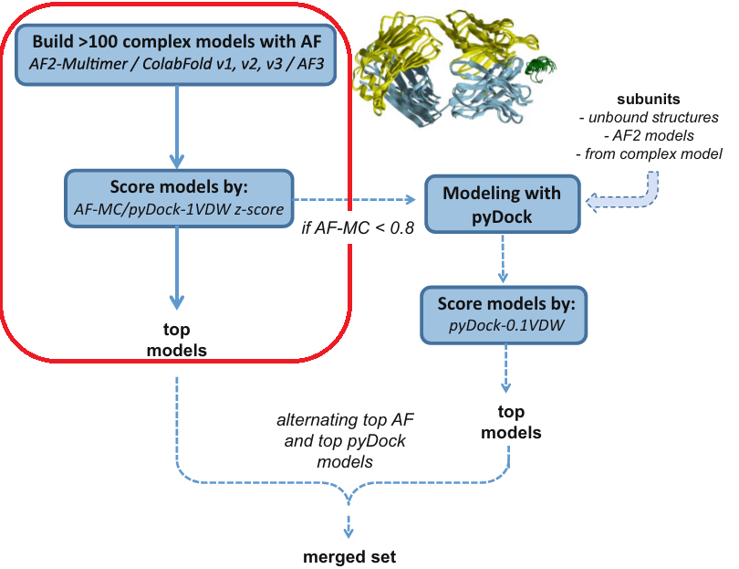

# ⚠️ This repository is currently undergoing refactoring. Please wait a few days before using it.
# Integrating AlphaFold and pyDock for Protein–Protein Complex Modeling

This repository accompanies the chapter
**“Modeling Protein–Protein Complexes by Combining pyDock and AlphaFold”**
published in *Methods in Molecular Biology (2026)*, and provides a practical, reproducible implementation of the workflow described by **Rodríguez-Lumbreras et al.** .

The main goal is to demonstrate how **artificial intelligence–based modeling (AlphaFold2-Multimer and AlphaFold3)** can be combined with **energy-based scoring from pyDock** to improve the accuracy of protein–protein complex predictions, particularly for challenging cases such as:

* antibody–antigen complexes
* multiprotein assemblies
* weak or transient interactions
* highly flexible proteins

The repository is organized into **three folders**, each corresponding to a major stage of the workflow: model generation with AlphaFold, energy scoring with pyDock, and final integration of both approaches.

---

## 📁 Repository Structure

```
├── 3.1_Generating_3D_Models_for_Protein_Protein_Complexes_with_AlphaFold/
│     Scripts and examples for generating multiple conformations
│     using ColabFold AlphaFold2-Multimer, including the relaxation
│     of all recycled intermediate models generated by AF2.
│
├── 3.3.2_Computing_pyDock_Scores_for_a_Set_of_Complexes/
│     Templates (.ini ) generation, bindEy execution, chain reconstruction
│     with SCWRL, and parsed pyDock energy tables.
│
├── 3.4_Combined_Model_Confidence_and_pyDock_Score/
│     Scripts for integrating AlphaFold confidence metrics (AF-MC) with 
│     pyDock energy scores, including parsed energy tables and extracted 
│     AF2/AF3 metadata. This section computes z-scores for both scoring 
│     functions, generates combined AF–pyDock rankings, and outputs the 
│     final prioritized model list.
```

Each section contains ready-to-use scripts, test cases, and short usage notes.

---

## 🧬 3.1 Generating Diverse Complex Models with AlphaFold

This folder contains:

* Workflows for **AlphaFold2-Multimer** (versions v1, v2, v3) with:

  * increased recycles
  * dropout during inference
  * saving all intermediate recycles
  * multiple seeds
* ColabFold and LocalColabFold pipelines for rapid predictions without large databases.
* AlphaFold3 examples (server-based and local execution).
* FASTA templates for heterodimers and homooligomers.

The aim is to generate **>100 structural models per complex**, which is essential for the subsequent scoring stage.

---

## ⚡ 3.3.2 pyDock Energy Scoring

This folder includes:

* Automatic generation of all required `*.ini` files.
* Parallel execution of **bindEy** via **Greasy**.
* Optional side-chain reconstruction using **SCWRL3/4**.
* Example `*.ene` energy tables including:

  * Electrostatics (ELE)
  * Desolvation (DESOLV)
  * Van der Waals (VDW)
  * pyDock total energy (0.1·VDW)
  * pyDock total energy (1.0·VDW)

The **VHH–RNase A (PDB 4POU)** complex is provided as an illustrative example.

---

## 🔗 3.4. Integrating AlphaFold Confidence and pyDock Energies

**combining AlphaFold model confidence (AF-MC = 0.8·ipTM + 0.2·pTM) with pyDock energies using z-score normalization.**

Included:

* Extraction of AF-MC from AF2 `log.txt` or AF3 `summary_confidence.json`.
* Computation of:

  ```
  Z = (X − μ) / σ
  ```
* Calculation of:

  * `Z_AF-MC`
  * `Z_pyDock-1VDW`
  * `Z_combined = Z_AF-MC – Z_pyDock-1VDW`
* Final ranking and filtering of top predictions.

When **AF-MC < 0.8**, the pipeline automatically falls back to **classical pyDock docking**, following the decision tree shown in Fig. 1 of the chapter.
<p align="center">
  
</p>

In this repository, **only the components highlighted in the red box of the figure are implemented**, namely:

* Generation of AlphaFold2-Multimer models using **ColabFold** (optional use AlphaFold3 server)
* Extraction of **ipTM** and **pTM**
* Computation of **Model Confidence (AF-MC)**
* Calculation of **pyDock energy scoring** for AF2-generated complexes

The remaining module—**the docking stage starting from monomeric or unbound structures**—is **not included** here.
If docking poses are needed, they can be generated via the **pyDockWEB server**:

👉 [https://life.bsc.es/pid/pydockweb](https://life.bsc.es/pid/pydockweb)

---

## 📘 Case Studies Included

1. **VHH–RNase A (4POU)**
   → AF2 rank 1 fails; pyDock identifies an acceptable model.
---

## 🛠 Requirements

* Python ≥ 3.8
* pyDock ≥ 3.0
* SCWRL3 or SCWRL4
* Greasy (for task parallelization)
* AlphaFold2-Multimer / ColabFold / AlphaFold3 (depending on workflow)

---

## 🚀 Quick Installation

```bash
git clone https://github.com/PyDock/AF_pyDock/
cd AF_pyDock
```

Each internal folder includes its own usage notes and example scripts.

---

## 📄 Citation

If you use this repository, please cite:

> Rodríguez-Lumbreras LA, Monteagudo V, Fernández-Recio J.
> *Modeling Protein–Protein Complexes by Combining pyDock and AlphaFold.*
> Methods in Molecular Biology (2026).
>

---

## 🤝 Contributing

Contributions, suggestions, and pull requests are welcome.

---

## 📧 Contact

For questions related to the protocol or pyDock software:

**[Juan Fernández-Recio Group](https://model3dbio.csic.es/)**
