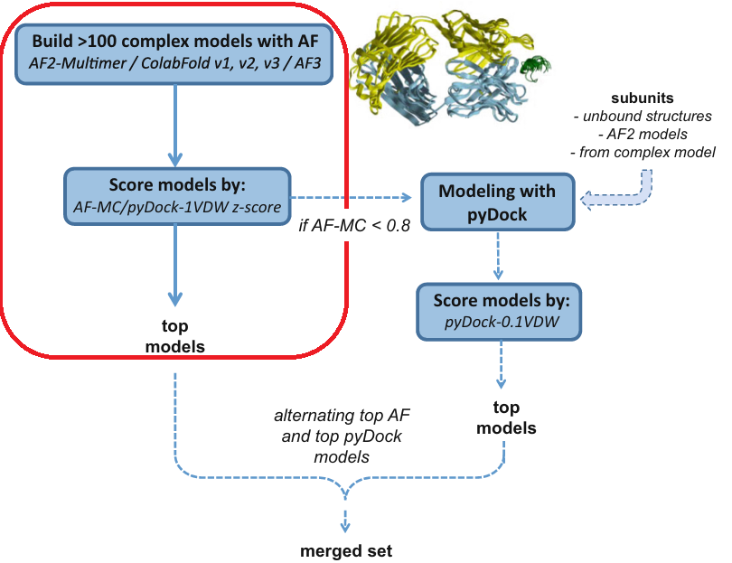

# Integrating AlphaFold and pyDock for Protein–Protein Complex Modeling (Refactor Ongoing)

This repository accompanies the chapter
**“Modeling Protein–Protein Complexes by Combining pyDock and AlphaFold”**
published in *Methods in Molecular Biology (2026)*, and provides a practical, reproducible implementation of the workflow described by **Rodríguez-Lumbreras et al.** .

The main goal is to demonstrate how **artificial intelligence–based modeling (AlphaFold2-Multimer and AlphaFold3)** can be combined with **energy-based scoring from pyDock** to improve the accuracy of protein–protein complex predictions, particularly for challenging cases such as:

* antibody–antigen complexes
* multiprotein assemblies
* weak or transient interactions
* highly flexible proteins

## Repository organization

This repository includes an adapted helper for installing **ColabFold** locally.
It does not reproduce the complete local **AlphaFold 3 (AF3)** installation;
instead, it provides a short AF3 overview and links to the separately maintained
installation guide. For the complete scientific protocol, refer to the book
chapter [**Modeling Protein–Protein Complexes by Combining pyDock and
AlphaFold**](https://doi.org/10.1007/978-1-0716-4828-5_15), published in
*Methods in Molecular Biology* (2026).

For the local **AlphaFold 3 installation instructions**, refer to
[AlphaFold3-Conda-Install](https://github.com/Model3DBio/AlphaFold3-Conda-Install).

The repository is organized into five main workflow folders:

---

## 📁 Repository Structure

```
├── 2.2.3_ColabFold_on_a_Local_Machine_with_LocalColabFold/
│     Adapted LocalColabFold installer, requirements, activation notes,
│     troubleshooting and upstream attribution.
│
├── 2.2.4_AlphaFold3/
│     Brief overview of AlphaFold Server and local AF3, including links to the
│     official parameter request and the external Conda installation guide.
│
├── 3.1_Generating_3D_Models_for_Protein_Protein_Complexes_with_AlphaFold/
│     Scripts for generating multiple conformations with ColabFold (AlphaFold2-Multimer)
│     and models generated by AlphaFold 3, plus an optional helper to relax
│     AlphaFold2 PDB models before pyDock scoring.
│
├── 3.3.2_Computing_pyDock_Scores_for_a_Set_of_Complexes/
│     Templates (.ini ) generation, bindEy execution, chain reconstruction
│     with SCWRL, and parsed pyDock energy tables.
│
├── 3.4_Combined_Model_Confidence_and_pyDock_Score/
│     Scripts for integrating AlphaFold confidence metrics (AF-MC) with 
│     pyDock energy scores, including parsed energy tables and extracted 
│     AF2/AF3 metadata. This section computes z-scores for both scoring 
│     functions, generates combined AF–pyDock rankings, and outputs the 
│     final prioritized model list.
```

Each section provides the relevant scripts or usage notes. Precomputed test cases
are supplied separately under `Case_Studies_Included/`.

---

## 🛠 2.2.3 Installing ColabFold locally

This section contains `install_colabbatch_linux.sh`, an adapted version of the
Linux installer from
[YoshitakaMo/localcolabfold](https://github.com/YoshitakaMo/localcolabfold).
It creates or reuses a Conda environment, installs the ColabFold/AlphaFold2
dependencies and downloads the model parameters.

The installer modifies a Conda environment and downloads substantial external
data. Read
[`2.2.3_README.md`](2.2.3_ColabFold_on_a_Local_Machine_with_LocalColabFold/2.2.3_README.md)
before running it, especially the installation-location, existing-environment
and reproducibility warnings.

---

## 🧬 2.2.4 AlphaFold 3 access and installation

AlphaFold 3 can be accessed through
[AlphaFold Server](https://alphafoldserver.com/) or installed locally after
requesting the model parameters from Google DeepMind. The local installation is
documented in the external
[AlphaFold3-Conda-Install](https://github.com/Model3DBio/AlphaFold3-Conda-Install)
guide rather than duplicated here.

See [`2.2.4_README.md`](2.2.4_AlphaFold3/2.2.4_README.md) for the supported
workflow routes, parameter access and license distinctions.

---

## 🧬 3.1 Generating Diverse Complex Models with AlphaFold

This folder contains:

* Workflows for **AlphaFold2-Multimer** (versions v1, v2, v3) with:

  * increased recycles
  * dropout during inference
  * saving all intermediate recycles
  * multiple seeds
* Optional relaxation of unrelaxed AlphaFold2 PDB models with `colabfold_relax`.
* Scripts using a local ColabFold installation for rapid predictions without
  downloading the full AlphaFold database set.
* AlphaFold3 examples (server-based and local execution), including CIF-to-PDB conversion.
* FASTA templates for heterodimers and homooligomers.

The main helper scripts are `run_alphafold2_multimer.sh`,
`relax_alphafold2_models.sh`, `run_alphafold3.sh`, and `cif_to_pdb.py`.

The aim is to generate **>100 structural models per complex**, which is essential for the subsequent scoring stage.

---

## ⚡ 3.3.2 pyDock Energy Scoring

This folder includes:

* Automatic generation of all required `*.ini` files.
* Parallel execution of **bindEy** via **Greasy**.
* Optional side-chain reconstruction using **SCWRL3/4**.
* Example `*.ene` energy tables including:

  * Electrostatics (ELE)
  * Desolvation (DESOLV)
  * Van der Waals (VDW)
  * pyDock total energy (0.1·VDW)
  * pyDock total energy (1.0·VDW)

The **VHH–RNase A (PDB 4POU)** complex is provided as an illustrative example.

---

## 🔗 3.4. Integrating AlphaFold Confidence and pyDock Energies

**combining AlphaFold model confidence (AF-MC = 0.8·ipTM + 0.2·pTM) with pyDock energies using z-score normalization.**

Included:

* Extraction of AF-MC from AF2 `log.txt` or AF3 `summary_confidence.json`.
* Computation of:

  ```
  Z = (X − μ) / σ
  ```
* Calculation of:

  * `Z_AF-MC`
  * `Z_pyDock-1VDW`
  * `Z_combined = Z_AF-MC – Z_pyDock-1VDW`
* Final ranking and filtering of top predictions.

When **AF-MC < 0.8**, the pipeline automatically falls back to **classical pyDock docking**, following the decision tree shown in Fig. 1 of the chapter.
<p align="center">
  
</p>

In this repository, **only the components highlighted in the red box of the figure are implemented**, namely:

* Generation of AlphaFold2-Multimer models using **ColabFold** (optional use AlphaFold3 server)
* Extraction of **ipTM** and **pTM**
* Computation of **Model Confidence (AF-MC)**
* Calculation of **pyDock energy scoring** for AF2/AF3-generated complexes

The remaining module—**the docking stage starting from monomeric or unbound structures**—is **not included** here.
If docking poses are needed, they can be generated via the **pyDockWEB server**:

👉 [https://life.bsc.es/pid/pydockweb](https://life.bsc.es/pid/pydockweb)

---

## 📘 Case Studies Included

1. **VHH–RNase A (4POU)**
   → AF2 rank 1 fails; pyDock identifies an acceptable model.
2. **Fab–VEGF (2FJG)**
   → Additional case with precomputed AF2/AF3 model outputs.

The case-study archives include precomputed AlphaFold2-Multimer and AlphaFold3
outputs so users can test the downstream pyDock scoring and z-score analysis
without recalculating the most computationally expensive step.

---

## 🛠 Requirements

* Python ≥ 3.8
* GNU Bash and `wget` for the optional ColabFold installer
* pyDock ≥ 3.0
* SCWRL3 or SCWRL4
* Greasy (for task parallelization)
* AlphaFold2-Multimer / ColabFold / AlphaFold3 (depending on workflow)
* `colabfold_relax` for the optional AF2 relaxation step

---

## 🚀 Quick Installation

```bash
git clone https://github.com/PyDock/AF_pyDock/
cd AF_pyDock
```

Each internal folder includes its own usage notes and example scripts.

For local model-generation setup, start with:

* [`2.2.3_README.md`](2.2.3_ColabFold_on_a_Local_Machine_with_LocalColabFold/2.2.3_README.md)
  for ColabFold;
* [`2.2.4_README.md`](2.2.4_AlphaFold3/2.2.4_README.md) for AlphaFold Server
  and local AF3 installation links.

---

## 📄 Citation

If you use this repository, please cite:

> Rodríguez-Lumbreras LA, Monteagudo V, Fernández-Recio J.
> *Modeling Protein–Protein Complexes by Combining pyDock and AlphaFold.*
> Methods in Molecular Biology (2026).
>

---

## 🤝 Contributing

Contributions, suggestions, and pull requests are welcome.

---

## 📧 Contact

For questions related to the protocol or pyDock software:

**[Juan Fernández-Recio Group](https://model3dbio.csic.es/)**
